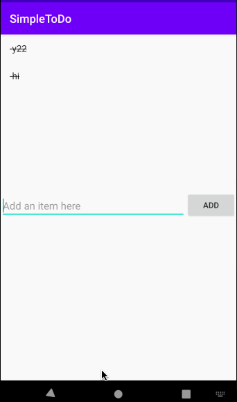

# Pre-work - *SimpleToDo*

**SimpleToDo** is an android app that allows building a todo list and basic todo items management functionality including adding new items, editing and deleting an existing item.

Submitted by: **Ziyue Qian**

Time spent: **4** hours spent in total

## User Stories

The following **required** functionality is completed:

* [x] User can **view a list of todo items**
* [x] User can **successfully add and remove items** from the todo list
* [x] User's **list of items persisted** upon modification and and retrieved properly on app restart

The following **optional** features are implemented:

* [x] User can **tap a todo item in the list and bring up an edit screen for the todo item** and then have any changes to the text reflected in the todo list

The following **additional** features are implemented:

* [x] User can **complete a todo item in the list and it will be striked out** to remind people what they've accomplished

## Video Walkthrough

Here's a walkthrough of implemented user stories:

GIF created with [LiceCap](http://www.cockos.com/licecap/).

## Notes

While I added a new featuer to complete the to-do list, I implemented it by adding a marker to the string so that the ItemAdapter can put a strikethrough through that specific position's text when it detects the marker. I wasn't sure how to do it in a more elegant way, so I hope to learn more about passing additional data between the ItemAdapter and the MainActivity (such as a boolean for isCompleted) or to access a specific TextView from the ItemAdapter in other files. 

## License

    Copyright [2020] [Ziyue Qian]

    Licensed under the Apache License, Version 2.0 (the "License");
    you may not use this file except in compliance with the License.
    You may obtain a copy of the License at

        http://www.apache.org/licenses/LICENSE-2.0

    Unless required by applicable law or agreed to in writing, software
    distributed under the License is distributed on an "AS IS" BASIS,
    WITHOUT WARRANTIES OR CONDITIONS OF ANY KIND, either express or implied.
    See the License for the specific language governing permissions and
    limitations under the License.
